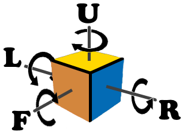
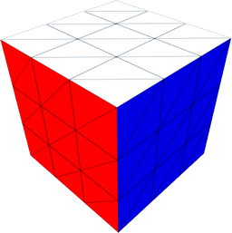
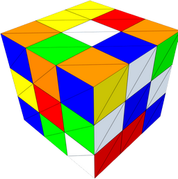

# Rubik's Cube :neckbeard:

Puzzle powered by Unity engine.

Rubik's Cube is a 3-D combination puzzle invented in 1974 by Hungarian sculptor and professor of architecture Ernő Rubik.

The number of all possible different states of the Rubik cube 3x3x3 is equal to `(8! × 38-1) × (12 × 212-1) / 2 = 43,252,003,274,489,856,000` 🎲

* [Rubik's Cube](https://en.wikipedia.org/wiki/Rubik%27s_Cube)

* [How to Solve the Rubik's Cube](https://en.wikibooks.org/wiki/How_to_Solve_the_Rubik%27s_Cube)

* [God's algorithm](https://en.wikipedia.org/wiki/God%27s_algorithm)

## About

* Plain Unity project (no assets, no plugins, no frameworks)

* MVC design

* Full unit tests coverage for the magic cube's model

## Controls

| Rotate | Hotkeys |
| --- | --- |
| F | F |
| F' | LShift + F |
| R | R |
| R' | LShift + R |
| U | U |
| U' | LShift + U |
| B | B |
| B' | LShift + B |
| L | L |
| L' | LShift + L |
| D | D |
| D' | LShift + D |

## Examples

## TODOs

* Rotate animation

* Rotate by mouse dragging
